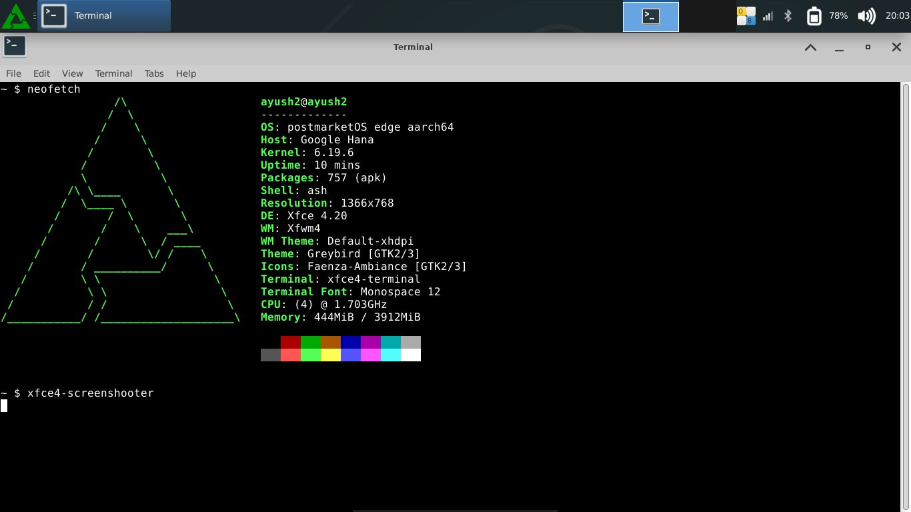

# 🐧 Linux on ARM Chromebook

> A complete guide to replacing ChromeOS with PostmarketOS on an ARM-based Chromebook using the depthcharge bootloader.

---

## 📋 Table of Contents

- [About This Project](#about-this-project)
- [Screenshot](#screenshot)
- [Supported Devices](#supported-devices)
- [Prerequisites](#prerequisites)
- [Step 1 — Identify Your Board](#step-1--identify-your-board)
- [Step 2 — Enable Developer Mode](#step-2--enable-developer-mode)
- [Step 3 — Enable USB Boot](#step-3--enable-usb-boot)
- [Step 4 — Download PostmarketOS Image](#step-4--download-postmarketos-image)
- [Step 5 — Flash the USB Drive](#step-5--flash-the-usb-drive)
- [Step 6 — Boot from USB](#step-6--boot-from-usb)
- [Step 7 — Flash to Internal eMMC](#step-7--flash-to-internal-emmc)
- [Post Install — First Steps](#post-install--first-steps)
- [Installing Software](#installing-software)
- [Contributing](#contributing)

---

## About This Project

Most Linux installation guides assume x86 hardware. ARM-based Chromebooks have a completely different boot chain — **depthcharge** instead of UEFI/BIOS — which means standard Linux ISOs simply won't boot.

This guide documents the correct, working process for installing PostmarketOS on ARM Chromebooks. PostmarketOS ships device-specific kernels with the right drivers for each board, making it the most reliable Linux option for ARM Chromebooks today.

---

## Screenshot

PostmarketOS running on Google HANA (MT8173) with XFCE4 desktop:



---

## Supported Devices

| Board Codename | SoC | Status |
|---|---|---|
| HANA / Oak | MediaTek MT8173 | ✅ Well supported |
| Gru (Kevin, Bob) | Rockchip RK3399 | ✅ Well supported |
| Veyron (Jerry, Minnie) | Rockchip RK3288 | ✅ Well supported |
| Trogdor | Snapdragon 7c | ⚠️ Partial support |
| Kukui | MediaTek MT8183 | ⚠️ Partial support |

> Check the [PostmarketOS device wiki](https://wiki.postmarketos.org/wiki/Devices) for the full and up to date device list.

---

## Prerequisites

### Hardware
- ARM-based Chromebook capable of developer mode
- USB drive — minimum **8GB**

### Software
- [Rufus](https://rufus.ie) — USB flashing tool (**must use DD Image mode**, not ISO mode)
- [7-Zip](https://www.7-zip.org) — for extracting `.img.xz` files

---

## Step 1 — Identify Your Board

Before anything else, confirm your board and CPU architecture. Open **crosh** (`Ctrl+Alt+T`) in ChromeOS, then type `shell`:

```bash
# Check board name
crossystem hwid

# Check CPU architecture
uname -m

# Check CPU details
cat /proc/cpuinfo | grep -i "hardware\|model name"
```

**What to look for:**

| Output | Meaning |
|---|---|
| Board name (e.g. `HANA`, `KEVIN`) | Identifies your exact device |
| `aarch64` | ARM 64-bit — correct for this guide |
| `armv7l` | ARM 32-bit — use armhf images instead |

---

## Step 2 — Enable Developer Mode

> ⚠️ **This wipes all local ChromeOS data.** Back up anything important first.

1. Press `Esc + Refresh + Power` simultaneously
2. At the recovery screen press `Ctrl + D`
3. Confirm by pressing `Enter`
4. Wait ~5 minutes for the transition to complete
5. On reboot, press `Ctrl + D` at the white screen to continue

You are now in Developer Mode.

---

## Step 3 — Enable USB Boot

Open crosh (`Ctrl+Alt+T`) → type `shell`:

```bash
sudo enable_dev_usb_boot
```

Expected output:
```
SUCCESS: Booting any self-signed kernel from SSD/USB/SDCard slot is enabled.
```

---

## Step 4 — Download PostmarketOS Image

PostmarketOS maintains official pre-built images per device:

**Image Server:** https://images.postmarketos.org/bpo/

Navigate to the latest stable version folder, then find your device. For example:
- MT8173 (HANA/Oak) → `google-oak/`
- RK3399 (Gru) → `google-gru/`
- RK3288 (Veyron) → `google-veyron/`

Inside your device folder, choose a UI:

| UI | Best For |
|---|---|
| `xfce4` | Desktop use — recommended |
| `phosh` | Touch/phone-style interface |
| `gnome-mobile` | GNOME mobile UI |
| `console` | Minimal, no desktop |

Download the file ending in `.img.xz`.

---

## Step 5 — Flash the USB Drive

### Using Rufus (Recommended)
1. Extract `.img.xz` using **7-Zip** → you'll get a `.img` file
2. Open Rufus
3. Select your USB drive
4. Click **SELECT** → choose the `.img` file
5. When prompted for mode → select **DD Image mode** ⚠️ (NOT ISO mode)
6. Click **START** and wait for completion

> ⚠️ Rufus must be used in **DD Image mode**. ISO mode will not boot on the depthcharge bootloader.

### Using dd (Linux/macOS)
```bash
# Extract first
xz -d your-image.img.xz

# Flash to USB (replace /dev/sdX with your USB drive)
sudo dd if=your-image.img of=/dev/sdX bs=4M conv=fsync status=progress
sync
```

> ⚠️ Double check the target device with `lsblk` before running dd. Writing to the wrong device will cause data loss.

---

## Step 6 — Boot from USB

1. Plug the flashed USB into your Chromebook
2. Power on
3. At the white **"OS verification is OFF"** screen press **`Ctrl + U`**

> You have ~3 seconds before it auto-boots ChromeOS. Press `Ctrl+U` quickly.

**First Boot Notes:**
- Screen may go black for 30-60 seconds — this is normal
- First boot can take 2-5 minutes on slower ARM chips
- PostmarketOS login screen will appear when ready

**Default Credentials:**
```
Username: user
Password: 147147
```

> Change your password immediately after first login with `passwd`

---

## Step 7 — Flash to Internal eMMC

> ⚠️ **This permanently replaces ChromeOS.** Make sure everything works correctly from USB before proceeding.

### 7a — Identify Your Drives

```bash
lsblk
```

Expected output:
```
NAME        SIZE  TYPE  MOUNTPOINTS
sda         15.1G disk              ← USB drive (source)
├─sda1       32M  part
├─sda2      256M  part  /boot
└─sda3      14.8G part  /
mmcblk0     29.1G disk              ← Internal eMMC (destination)
└─ ...
```

> Confirm which device is USB and which is eMMC before running the next command.

### 7b — Flash with dd

```bash
sudo dd if=/dev/sda of=/dev/mmcblk0 bs=1M conv=fsync,noerror
```

**Parameter breakdown:**

| Parameter | Meaning |
|---|---|
| `if=/dev/sda` | Input — your USB drive |
| `of=/dev/mmcblk0` | Output — internal eMMC |
| `bs=1M` | Block size — 1MB per chunk |
| `conv=fsync` | Flush writes properly to disk |
| `conv=noerror` | Continue if read errors occur |

> The cursor will appear frozen during the copy — this is normal. PostmarketOS uses BusyBox dd which shows no progress. Wait 15-20 minutes until the `~ $` prompt returns.

### 7c — Finish Up

```bash
sync
sudo poweroff
```

Remove the USB drive, then power on. PostmarketOS will boot from internal storage.

---

## Post Install — First Steps

### Connect to WiFi
```bash
sudo nmtui
```

### Update the System
```bash
sudo apk update && sudo apk upgrade
```

### Expand the Root Partition

After flashing, unused space on the eMMC will be unallocated. Expand the root partition to use it all:

```bash
sudo apk add e2fsprogs parted

# Resize — adjust partition number to match your lsblk output
sudo parted /dev/mmcblk0 resizepart 3 100%
sudo resize2fs /dev/mmcblk0p3
```

### Change Default Password
```bash
passwd
```

---

## Installing Software

PostmarketOS is based on **Alpine Linux** and uses the `apk` package manager:

```bash
# Search for a package
sudo apk search <packagename>

# Install a package
sudo apk add <packagename>

# Remove a package
sudo apk del <packagename>

# Update all packages
sudo apk update && sudo apk upgrade
```

### Useful Packages

```bash
sudo apk add firefox        # Web browser
sudo apk add vim            # Text editor
sudo apk add git            # Version control
sudo apk add python3        # Python
sudo apk add openssh        # SSH
sudo apk add htop           # System monitor
sudo apk add curl wget      # Download tools
```

---

## Contributing

Have notes for a board not covered here? Found something that needs fixing?

1. Fork this repo
2. Create a branch: `git checkout -b fix/your-board`
3. Add your notes or corrections
4. Open a Pull Request

Board-specific tips, tested configurations, and hardware compatibility notes are especially welcome.

---

## License

MIT — free to use, share, and modify.

---

*Tested on Google HANA (MT8173 / Cortex-A53) running PostmarketOS v25.12 with XFCE4.*
